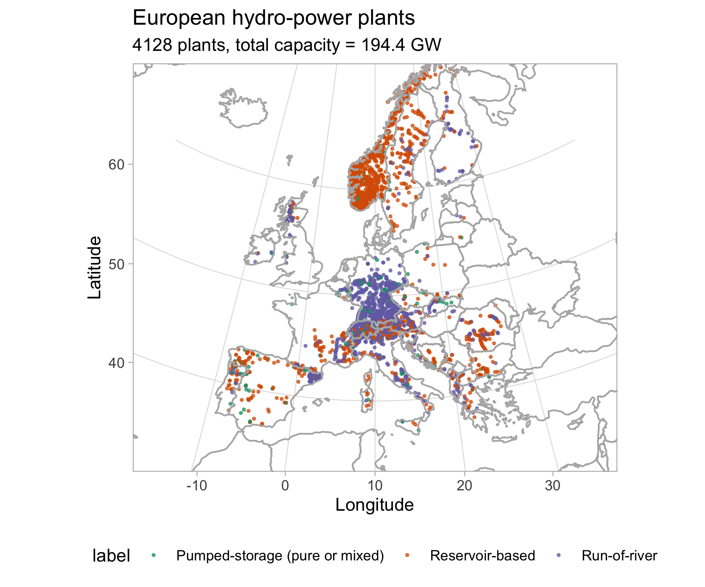

 
 

# JRC Hydro-power plants database

This dataset is an output of the Energy work package of the Water-Energy-Food-Ecosystems (WEFE) Nexus project at the European Commission's Joint Research Centre (JRC). This dataset has been created for power system modelling purposes and it is based on publicly available sources. This dataset tries to collect some basic information on all the European hydro-power plants. 

The dataset contains the following variables (documented in the data package JSON):
  - id of the plant
  - name of the power plants
  - installed capacity
  - country
  - coordinates
  - typology of the power plant (run-of-river, reservoir based or pumped-storage)
  - height of the dam
  - size of the usable reservoir in million of cubic meters
  - maximum storage capacity in MWh
  - link with the GEO and the PyPSA-EUR databases
  
The storage capacity  is reported only when directly available from the source, thus is **not** estimated or derived by us from the other variables. 

This dataset is released under [CC-BY-4.0 license](https://creativecommons.org/licenses/by/4.0/).

## Discuss & Contribute
If you have any question or comment the best way would be to add a post in the Issues to keep track of open and closed issues/questions.
If you want to contribute please [send me an email](mailto:matteo.de-felice@ec.europa.eu) or  submit a Pull Request on this repository. 

## Author and contributors
Here a list of all the people which have personally contributed to this dataset. If you think that your name should be here please send me an email.

   - Matteo De Felice, JRC: main author
   - Konstantinos Kanellopoulos, JRC
   - Ignacio Hidalgo-González, JRC
   - Hrvoje Medarac, JRC
   - Goran Stunjek, Goran Krajacic, University of Zagreb
   - Jonas Hörsch, Reiner Lemoine Institut (RLI) and KIT
   - Francesco Careri, JRC
   - Sebastian Busch, JRC
   - André Ortner, MVV Energie and TU Wien
   
## Coverage

The dataset contains 3793 hydro-power plants. This is a table summarising the installed capacity in GW for all the countries appearing in the database. 

|country                |   GW|
|:----------------------|----:|
|Albania                |  1.9|
|Austria                | 14.0|
|Belgium                |  1.4|
|Bosnia and Herzegovina |  2.0|
|Bulgaria               |  3.0|
|Croatia                |  2.1|
|Czech Republic         |  1.9|
|Finland                |  2.6|
|France                 | 21.5|
|FYR of Macedonia       |  0.6|
|Germany                | 10.4|
|Greece                 |  3.4|
|Hungary                |  0.0|
|Ireland                |  0.4|
|Italy                  | 18.6|
|Latvia                 |  1.5|
|Lithuania              |  1.0|
|Luxembourg             |  1.3|
|Montenegro             |  0.7|
|Norway                 | 33.2|
|Poland                 |  2.1|
|Portugal               |  6.4|
|Romania                |  5.0|
|Serbia                 |  2.8|
|Slovakia               |  2.5|
|Slovenia               |  1.2|
|Spain                  | 17.1|
|Sweden                 | 13.8|
|Switzerland            | 18.9|
|United Kingdom         |  4.0|

## Sources

The database has been built collecting the information from several other sources and then cross-checking and comparing in case of inconsistencies. The list of the used sources is here:

  - JRC Power Plants Database (PPDB): available soon online
  - [Global Energy Observatory (GEO)](http://globalenergyobservatory.org/)
  - [PyPSA-EUR](https://github.com/PyPSA/pypsa-eur)
  - [Global Reservoir and Dam Database (GRanD) 1.3](http://globaldamwatch.org/) 
  - [Marktstammdatenregister MaStR](https://www.marktstammdatenregister.de/MaStR)
  - [Engadiner Kraftwerke AG website](https://www.ekwstrom.ch/startseite.html)
  - [Latvenergo AS website](https://www.latvenergo.lv/)
  - [Gimeno-Gutiérrez and Roberto Lacal-Arántegui, Renewable Energy, 2015](https://www.sciencedirect.com/science/article/pii/S096014811400706X)
  - [Gerritsma, M.K. (2016) Faculty of Geosciences Theses](https://dspace.library.uu.nl/handle/1874/339185)
  - [Swiss committee on dams website](http://swissdams.ch/)
  - [VGB PowerTech e.V. website](https://www.vgb.org/)
  - [EDP website](www.edp.pt)
  - [Drinsko-Limske Hidroelektrane website](http://dlhe.rs/)
  - [Verbund website](https://www.verbund.com/)
  - [Geth et al., Renewable and Sustainable Energy Reviews, 2015](https://www.sciencedirect.com/science/article/pii/S1364032115007923)
  - Wikipedia EN, DE
  - [Karin Salevid, Uppsala Universitet, 2013](https://uu.diva-portal.org/smash/get/diva2:661286/FULLTEXT01.pdf)
  - [Vattenkraft.info](https://vattenkraft.info/)
  - [The United Nations Economic Commission for Europe (UNECE) website](http://www.unece.org/)
  - [Statkraft website](https://www.statkraft.com/)
  - [Salini-Impregilo website](www.salini-impregilo.com)
  - [HEP group website](hep.hr)
  - [Spanish Ministry of Agriculture, Fisheries and Food website](https://www.mapama.gob.es/)
  - [Comité Français des Barrages et Réservoirs website](http://www.barrages-cfbr.eu/)
  - [JP „Elektroprivreda HZ HB website](https://www.ephzhb.ba/)
  - [SSE website](https://sse.com/)
  - [WaterGenPower website](https://www.watergenpower.eu/)
  - [Compagnia Valdostana delle Acque website](http://www.cvaspa.it/)
  - [Fingrid website](https://www.fingrid.fi/)
  - [HE Đerdap website](http://www.djerdap.rs/)
  - [Vattenfall website](http://www.vattenfall.se/)
  - [Pöyry PLC website](https://www.poyry.com/)
  - [Innogy website](https://www.innogy.com/)
  - [Dravske elektrarne Maribor website](http://www.dem.si/)
  - [Hidroelektrarne na Spodnji Savi website](http://www.he-ss.si/)
  - [Savske elektrarne Ljubljana website](http://www.sel.si/)
  - [Kemijoki website](https://www.kemijoki.fi)
  - [NVE website](https://www.nve.no/)
 

